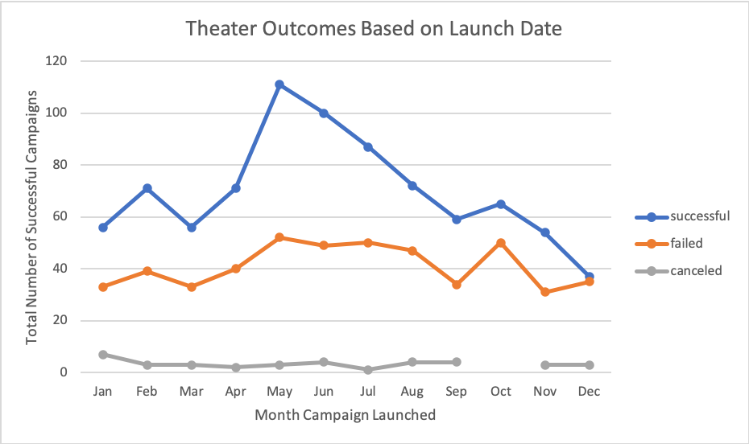
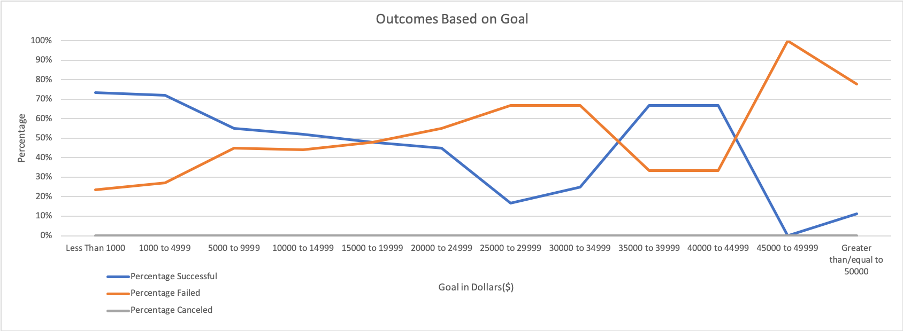

# Kickstarting with Excel: An Analysis of Kickstarter Campaigns

## Overview of Project
This project was conducted to help the client compare the kickstarter campaign run for their play in relation to other plays' launched dates and funding goals.

## Analysis and Challenges
This analysis was conducted in <a href="https://github.com/sstadnik1/kickstarter-analysis/blob/master/Kickstarter_Challenge.xlsx.zip">Excel</a> using a pivot table and =COUNTIF, =SUM, and division. The pivot table enabled the visualization of the parent category fundraiser to "theater" and look at the outcomes (i.e. successful, failed, or canceled) based on the month in which the kickstarter campaign was launched. The excel functions enabled me the data to be parsed by outcome and overall percentage to compare the dollar amount of the fundraising goal by the outcome. 

This analysis was straightforward. There were some minor complications with ensure the data across different sheets lined up to the proper column and row in the equation.

### Analysis of Outcomes Based on Launch Date

Based on the data provided, the most successful theater fundraising campaigns were launched in summer months. Notably, May has the most successful launches, followed by June, July, and August. However, this finding is less impressive when looking at the percent successful theater outcomes by month, rather than the total number successful. The data still supports May with the highest success rate (at 67%), but 10 of the 11 subsequent rates of success are no less than 9% of May's success rate. 

  

### Analysis of Outcomes Based on Goals

The four most successful goal ranges are: Less than $1000, $1000-$4999, $35000-$39999, and $40000-$44999. Th 4 least successful goal ranges are: $25000-$24999, $30000-$34999, $45000-$49000, and greater than/equal to $50000. Not displayed in the graph, overall, 65% of the total projects were successful and 33% of the total projects failed. This demonstrates that around the globe, 65% of kickstarter campaigns for plays were successful. This is consistent with the client finding their fundraising campaign for their play was successful. 

  

### Challenges and Difficulties Encountered

The formulas needed to interpret and visualize the data for kickstarter campaigns is rather straightforward. The biggest difficultly would be the power of the conclusions that can be drawn from this data because the larger campaigns had smaller sample sizes. For example, campaigns with the goal of $15000 or more had 25 or fewer total projects. Further, these findings looked at outcomes by launch date for the parent category "theater" and at the subcategory outcomes based on "goal." The data pulled into these categories is international data, and therefore, does not take into account the wide range of situational differences across countries.

## Results

- What are two conclusions you can draw about the Outcomes based on Launch Date? Two conclusions that can be drawn from about the Outcomes based on Launch Date 

- What can you conclude about the Outcomes based on Goals? The conclusion 

- What are some limitations of this dataset? Some of the limitations of this data set are: 

- What are some other possible tables and/or graphs that we could create? Some other tables and graphs that could be helpful for visualizing this data would be
