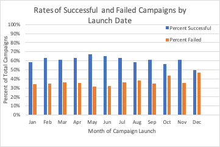

# Kickstarting with Excel: An Analysis of Kickstarter Campaigns

## Overview of Project
This project was conducted to help the client compare kickstarter campaign success rates specifically looking at success/fail/cancel rates of theater campaigns based on their launch date and success/fail/cancel rates of play campaigns based on their fundraising goals.

## Analysis and Challenges
This analysis was conducted in <a href="https://github.com/sstadnik1/kickstarter-analysis/blob/master/Kickstarter_Challenge.xlsx.zip">this Excel file</a> using a pivot table and =COUNTIF, and basic algebra. The pivot table enabled the visualization of the fundraiser category "theater" based on the outcomes (i.e. successful, failed, or canceled) and month the kickstarter campaign was launched. The excel functions enabled the data to be analyzed by outcome and fundraising goal. This analysis were straightforward. The biggest challenges arise in making informed decisions based on the data due to uncollected variables (i.e. type of advertising done for each campaign). 

### Analysis of Outcomes Based on Launch Date

Based on the data provided, the most successful theater fundraising campaigns were launched in summer months. Notably, May has the most successful launches, followed by June, July, and August. However, this finding is less impressive when looking at the percent successful theater outcomes by month, rather than the total number successful. The data still supports May with the highest success rate (at 67%), but 10 of the 11 subsequent rates of success are no less than 9% of May's success rate. 

  

### Analysis of Outcomes Based on Goals

The four most successful goal ranges for play kickstarer campaigns are: Less than $1000, $1000-$4999, $35000-$39999, and $40000-$44999. Th 4 least successful goal ranges are: $25000-$24999, $30000-$34999, $45000-$49000, and greater than/equal to $50000. Not displayed in the graph, overall, 65% of the total projects were successful and 33% of the total projects failed. This demonstrates that around the globe, 65% of kickstarter campaigns for plays were successful. This is consistent with the client also having a successful play campaign.

  

### Challenges and Difficulties Encountered

The formulas needed to interpret and visualize the data for kickstarter campaigns is rather straightforward. The biggest difficultly would be the power of the conclusions that can be drawn from this data because there are fewer larger campaigns. For example, campaigns with the goal of $15,000 or more had 25 or fewer total projects. Further, these findings looked at outcomes by launch date for the parent category "theater" and at the subcategory outcomes based on "goal." The data pulled into these categories is international data, and therefore, does not take into account the wide range of situational differences across the country.

## Results

- Two conclusions that can be drawn from about the Outcomes based on Launch Date is that May is the best time to lauch a campaign and that December is the worst time to launch a campaign. May has the most successful campaign launches (by percent and total number) and the lowest percent of failed campaigns. December has the highest percentage of failed campaigns and lowest percent of successful campaigns.

  

- The Outcomes based on Goals shows that 90% of the successful play campaigns had funding goals of under $10,000. However, due to the higher success rates for campaigns with larger goals, it can be concluded that those larger campaigns likely have a more strategic plan to achieve their funding goal.

  

- The limitations of this data set is that we do not have data on the type of advertising that was done for each campaign. Kickstarter campaigns need to be shared and have greater visibility in order to get more investors. Therefore, having data on number of views on the campaign vs number of donors would inform the client of the percentage of people that saw the campaign and actually invested. Additionally, having some metrics on marketing/advertising of the campaign would inform clients on best ways to publicize their campaigns in order to understand why certain campaigns by size and launch date were successful or failed.  

-  Another visualization that would be helpful for visualizing this data would be to look at the percent successful by time of year and by size of the campaign. Futher, the client should also filter out the data by location and category of campaign in order to have the most relevant data and control for variables.
